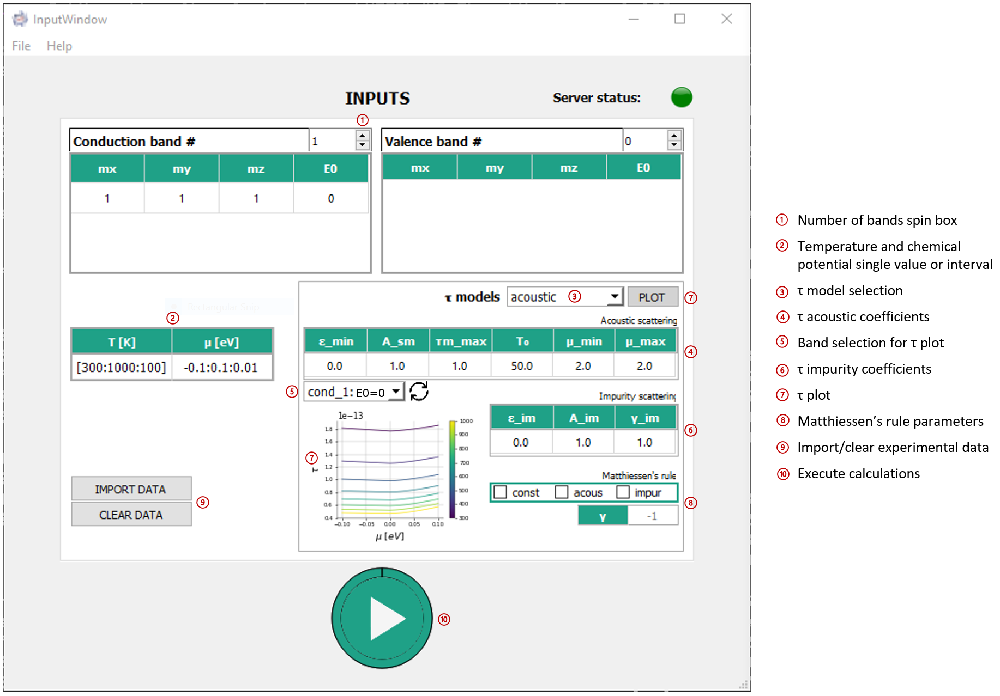
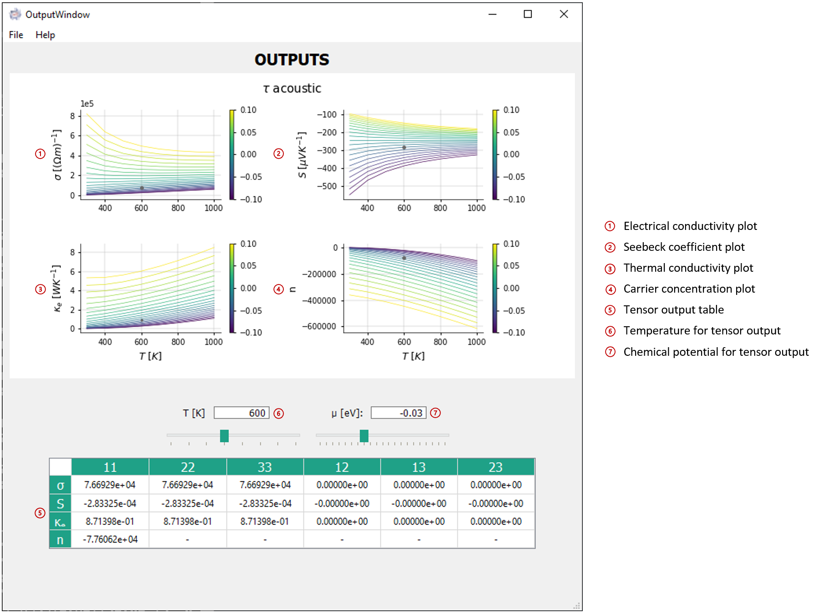

# m*2T 

*Transport properties from multi-valley density of states in the relaxation time approximation.*

[](https://marcofornari.github.io/etrasport/dev)

## Directory structure
- **docs**: documentation of the code
- **Mstar2t**: Julia package implementing the computing unit of m*2T
  - src: source code
    - transport: Julia package which contains the methods to compute the transport coefficients
    - scattering: Julia package that implements different models for the relaxation time
    - plot: Julia package to plot the results of the calculations as a function of temperature and chemical potential
    - server: Julia package to implement the computing unit as a server
    - other: collection of utility functions
  - examples: collection of scripts using the Mstar2t Julia package
  - perf: script to test the performance of the code
- **Interface**: Python implementation of the client interface
  - GUI: graphical user interface source code
  - CLI: command-line interface source code

## Requirements 

- Julia >= 1.6
- python >= 3.7

## Dependencies

### Computing unit (Julia)

- ArgParse == 1.1
- CSV == 0.10
- CairoMakie == 0.10
- Colors == 0.4
- DataFrames == 1.4
- Distributions == 0.25
- Einsum == 0.4
- FastGaussQuadrature == 0.5
- GLMakie == 0.8
- HTTP == 1.7
- HypergeometricFunctions == 0.3
- JSON == 0.21
- LaTeXStrings == 1.3
- LinearAlgebra == 3.4
- Parameters == 0.12
- PlotUtils == 1.3
- PolyLog == 2.3
- Polynomials == 3.2
- QuadGK == 2.6
- SpecialFunctions == 2.1

### Interface

- numpy
- pandas
- requests
- matplotlib
- colorama
- argparse
- PySide2==5.15

## Installation

First, clone the repository:

HTTPS: 
```bash	
$ git clone https://github.com/marcofornari/etrasport.git
```

SSH:
```bash	
$ git clone git@github.com:marcofornari/etrasport.git
```

### Computing unit

```bash
$ cd Mstar2t
$ julia
```

Enter the Julia package manager (typing `]`) and run the following commands:

```bash
(v1.6) pkg> activate .
(Mstar2t) pkg> instantiate
```

### Interface

Unix/Mac:

```bash
$ cd Interface
$ python3.7 -m venv Interface
$ source Interface/bin/activate
(Interface) $ pip install --upgrade pip
(Interface) $ python -m pip install -r requirements.txt
```

Windows:

```Powershell
> cd Interface
> python3.7 -m venv Interface
> .\Interface\Scripts\activate
(Interface) > pip install --upgrade pip
(Interface) > python -m pip install -r requirements.txt
```

## Usage

There are two options to run m*2t: GUI or Command Line Interface (CLI). Both ways are designed to automatically set up the correct environment for the computing server.

### Usage (with GUI)

```bash
(Interface) $ cd Interface/GUI
(Interface) $ python run_gui.py
```

### Usage (with CLI)

First run the server (computing unit)
```bash
(Interface) $ cd Interface/CLI
(Interface) $ python run_cli.py
```

On a new shell, send simulations requests to the server by running:

```bash
(Interface) $ cd Interface/CLI
(Interface) $ python compute.py -i <input_file> --<tensor_name> --<plot>
```

**Note:** before running a calculation, edit the `results fullpath` argument in the input_file. This path identifies the location where the results are exported and must be in the **same machine** in which the server is running.


## Examples 

### GUI





### (CLI Python interface)

```bash
(Interface) $ python compute.py -i data.txt --conductivity --seebeck --concentration --tplot
(Interface) $ python compute.py -i data.txt -esn --tplot
```

## Help (CLI Python interface)

```bash
(Interface) $ python compute.py --help

usage: compute.py [-h] -i INPUTFILE [--conductivity] [--seebeck] [--thermal] [--concentration] [--tplot] [--muplot]

optional arguments:
  -h, --help            show this help message and exit
  -i INPUTFILE, --inputfile INPUTFILE path to input file
  --conductivity, -e    compute electrical conductivity
  --seebeck, -s         compute Seebeck coefficient
  --thermal, -k         compute thermal conductivity
  --concentration, -n   compute carrier concentration
  --tplot               Temperature plot of the tensors
  --muplot              Fermi level plot of the results
```

## Troubleshooting

If the environment gets corrupted and when launching the server you get a `LoadError: ArgumentError` exception similar to this:
```bash
ERROR: LoadError: ArgumentError: <PackageName> is required but does not seem to be installed:
 - Run `Pkg.instantiate()` to install all recorded dependencies.
 ```
 you may try the following steps (see below):
 1. Remove the `Manifest.toml` file inside `Mstar2t`;
 2. Open the julia REPL;
 3. Enter the julia package manager (typing `]`); 
 4. Activate the `Mstar2t` env;
 5. Run `resolve`;
 6. Run `instantiate`.

```bash
$ cd Mstar2t
$ rm Manifest.toml 
$ julia               _

_       _ _(_)_     |  Documentation: https://docs.julialang.org
  (_)     | (_) (_)    |
   _ _   _| |_  __ _   |  Type "?" for help, "]?" for Pkg help.
  | | | | | | |/ _` |  |
  | | |_| | | | (_| |  |  Version 1.6.0-rc2 (2021-03-11)
 _/ |\__'_|_|_|\__'_|  |  Official https://julialang.org/ release
|__/                   |

(@v1.6) pkg> activate .
(Mstar2t) pkg> resolve
(Mstar2t) pkg> instantiate
 ```
This should clean and rebuild the environment with the correct dependencies. 
